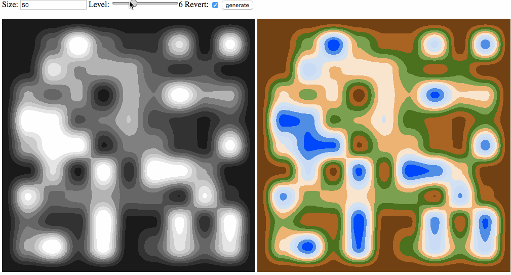

# Heightmap-generator

Simple implementation of heightmap generation for video game terrain rendering.
[Demo here](https://clemdelp.github.io/heightmap-generator/demo.html)




# Installation

```
npm install heightmap-generator
import heightmap from 'heightmap-generator'
const noise = generateNoise(size, height, revert)
```

* size: map size
* height: Number of desired height level
* revert: reverse colors
* noise: output matrix

# License
MIT
